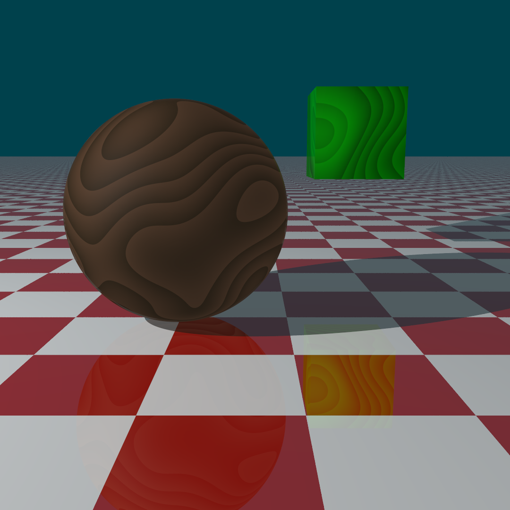

# Extension: Wooden3DTexture

### Author: Jan Matějka

### Category: Texture

### Namespace: Rendering.JanMatejka

### Class name: WoodenTexture : ITexture

### ITimeDependent: No

### Source file: WoodenTexture.cs, PerlinNoise.cs

A simple 3D texture simulating the structure of wood. This texture is deterministically generated according to a seed using Perlin Noise function in three dimensions.

When creating a new instance of this texture, a user can input a seed, two colors (it is best to use 2 shades of a color) which the texture will use, and a coefficient called LineFrequency which determines the amount of "wood lines" in the texture (5.0 worked quite good for me).

#### Usage
##### Scene snippet example
```
using Rendering.JanMatejka;

...

// Sphere
Sphere s = new Sphere();
root.InsertChild(s, Matrix4d.Identity);
s.SetAttribute(PropertyName.TEXTURE, new WoodenTexture(1337));
s.SetAttribute(PropertyName.MATERIAL, new PhongMaterial(new double[] { 1.0, 0.8, 0.1 }, 0.1, 0.1, 0.01, 5));

// Cube
Cube c = new Cube();
root.InsertChild(c, Matrix4d.Scale(1.2) * Matrix4d.CreateTranslation(1.5, 0.2, 2.4));
c.SetAttribute(PropertyName.TEXTURE, new WoodenTexture(new double[] { 0.0, 1.0, 0.0 }, new double[] { 0.0, 0.3922, 0.0 }));
c.SetAttribute(PropertyName.MATERIAL, new PhongMaterial(new double[] { 1.0, 0.8, 0.1 }, 0.1, 0.1, 0.01, 5));
```
There are several constructors that you can use: 
* ``WoodenTexture (int seed = 1337)``
  * This uses default values for all the other arguments (LineFrequency = 5.0, colors are wood looking-like shades of brown).
* ``WoodenTexture (double lineFrequency, int seed = 1337)``
* ``WoodenTexture (double[] firstColor, double[] secondColor, int seed = 1337)``
* ``WoodenTexture (double[] firstColor, double[] secondColor, double lineFrequency, int seed = 1337)``

### Image example
