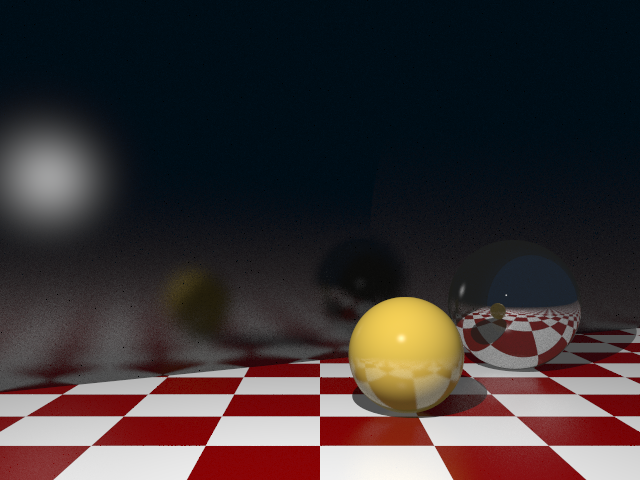

# Glossy effect for rendering

This extension adds new way to render objects, where imperfect reflections now create *glossy* effect on surfaces. **Works only with Phong Materials.**

How to use:
==
## A)
From within the script, set context attribute CTX_ALGORITHM to instance of this extension class.
`context[PropertyName.CTX_ALGORITHM] = new GlossyRaytracing(scene);`

*Warning: as of writing this, the raytracing program fails to change IImageFunction to this (I'm not sure why). Although this should be the correct way, if this does not work for you, use following method:*

## B)
Change Raytracing class directly in source code:

In file `MonteCarloRT.cs`, look for `FormSupport.getImageFunction()` function. Change it to return instance of this extension class.