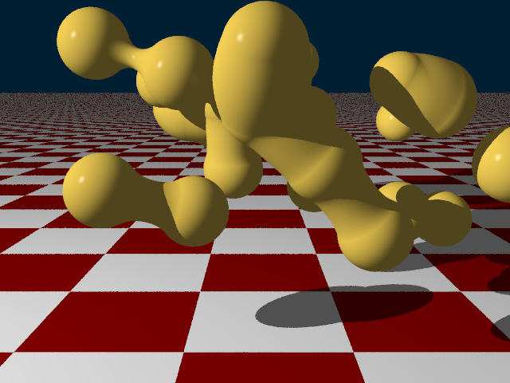

# Metaballs (Blobs) solid

This extensions contains new solid called metaball. More information about such object can be found [here](http://www.geisswerks.com/ryan/BLOBS/blobs.html).

To create your own metaballs, you have to first come with function describing "potential" in a space around it.
Once you have definition function, you also have to compute corresponding gradient function, that is, function which returns gradient at given coordinates. This gradient function is then used to determine normals on the surface of metaballs.

For example I will use basis function `f(radius) = radius^4 - radius^2 + 0.25` on domain `radius = (0, sqrt(2))`, otherwise zero.

Corresponding gradient function is:
`g(x,y,z) = (4*x*(x^2+y^2+z^2)-2*x, 4*y*(x^2+y^2+z^2)-2*y, 4*z*(x^2+y^2+z^2)-2*z)`

**The function must comply some restrictions:**
- With increasing radius, the potential should descend.
- At finite radius, the potential should reach zero.

Mandatory parameters are also *threshold*, that is the sum of potentials which define surface of metaballs, and *bound*, which is a distance from center where potential beyond this distance is 0.


Important thing this extension is that intersections with this solid is not explicitly computed, but rather I step along the ray in small increments and searching for intersection point. That means although many optimizations were introduced, rendering complex metaball scene will take long time. (3 minutes for 30 blobs)

Use example:
==
```cs


// container to hold all metaballs
MetaballsContainer container = new MetaballsContainer(threshold: 0.15);

// metaball functions delegates
BlobFunction f = (v) => {
    var rr = v.LengthSquared;
    if (rr > 0.5)
        return 0;
    return (rr * rr - rr + 0.25);
};
GradientFunction g = (v) => {
    var rr = v.LengthSquared;
    if (rr > 0.5)
        return Vector3d.Zero;
    return - new Vector3d(4 * v.X * rr - 2 * v.X, 4 * v.Y * rr - 2 * v.Y, 4 * v.Z * rr - 2 * v.Z);
};
// bound where there is no potential beyond this point
double bound = Math.Sqrt(2);

Metaball m;
m = new Metaball(f, g, bound);
container.AddMetaball(m, new Vector3d(1.2, -0.2, -5));
m = new Metaball(f, g, bound);
container.AddMetaball(m, new Vector3d(1.99, -0.2, -5));
```

Image:
==
