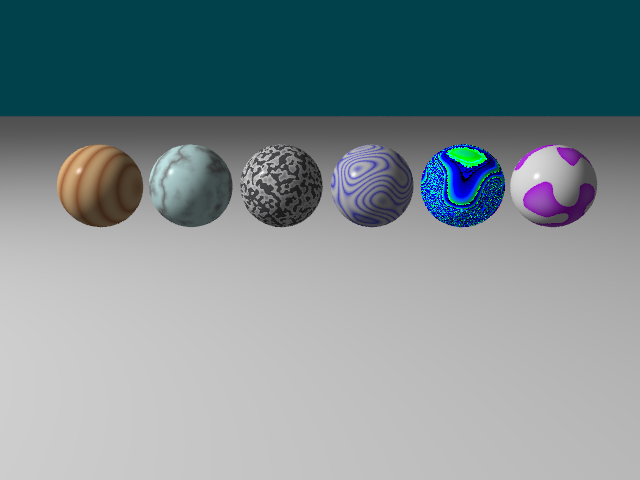
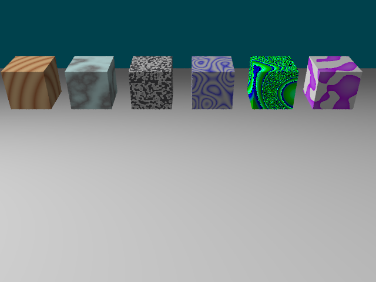

# Extension: 3DNoiseTexture

### Author: Katarina Dancejova

### Category: Textures

### Namespace: KatarinaDancejova

### Class names: PerlinNoise : ITexture, Wood : ITexture, Marble : ITexture, Porcelain : ITexture, Flakes : ITexture, Opal : ITexture

### ITimeDependent: No

### Source file: 3DNoiseTexture.cs

This extension implements pseudo-random noise, called Perlin noise and textures derived from it. The textures are applied using the object coordinates of an intersection.  

 

## PerlinNoise : ITexture
This class generates noise used for creation of other textures. It is also appliable as a texture itself.

User can edit these parameters:
a. double[] **Color1** and **Color2** - the colors of the texture

b. double **frequency** - frequency of the noise; the higher the number, the noisier the texture  

## Wood : ITexture
This class generates a texture similar to wood. It is based on the turbulence generated by the Perlin noise.

User can edit these parameters:
a. double[] **Color1** and **Color2** - the colors of the texture

b. double **frequency** - frequency of the rings

c. double **uDef**, **vDef** and **wDef** - the deformation of the rings in the u,v and w directions. The ratio of these parameters changes the rings' shape.

d. int **maxDepth** - the turbulence of this material is generated by creating a fractal out of the parameters mentioned above. **maxDepth** defines the "depth of the recursion" of the fractal.

## Marble : ITexture
This class generates a texture similar to marble. It is based on the turbulence generated by the Perlin noise.

User can edit these parameters:
a. double[] **Color1** and **Color2** - the colors of the texture

b. double **Fu**, **Fv** and **Fw** - the frequency of the veins in the u,v and w directions.

c. int **maxDepth** - defines the "depth of the recursion" of the fractal (for more details about turbulence see this parameter in **Wood** class description)

d. double **veinDiffusion** - changes the diffusivity of the veins (it also affects their frequency).

## Porcelain : ITexture
This class generates a texture similar to porcelain. It is based on the turbulence generated by the Perlin noise.

User can edit these parameters:
a. double[] **Color1** and **Color2** - the colors of the texture

b. double **frequency** - changes the frequency of the pattern

c. int **maxDepth** - defines the "depth of the recursion" of the fractal (for more details about turbulence see this parameter in **Wood** class description)

d. double **veinDiffusion** - changes the diffusivity of the veins (it also affects their frequency).

## Flakes : ITexture
This class generates flakes of different properties. It can generate basic full-color flakes, flakes fading to the inside, flakes with inner layers and more.  

User can edit these parameters:
a. double[] **Color1** and **Color2** - the colors of the texture

b. double **frequency** - changes the frequency of the pattern

c. int **cascadity** - affects whether the flakes have inner layers and if so, how many of them

d. double **flakeFade** - affects whether the flakes are fading to the inside and if so, how much

## Opal : ITexture
This class generates an interesting, exotic and unpredictable opal-like texture.

User can edit these parameters:
a. double[] **Color1** and **Color2** - the colors of the texture, they might not be the only ones appearing in the result

b. double **frequency** - changes the frequency of the "opal eyes" in the texture

c. double **diffusion** - changes the diffusivity of the eyes to the surroundings

Enjoy!